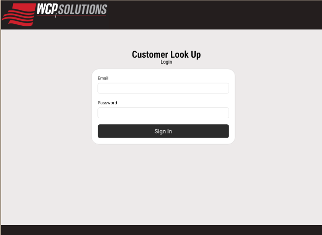

# WCP Solutions | Front End 

  

# About the Project
This web-based application is deisnged to assist the sales teams at WCP Solutions, Inc. in finding and managing customer information effeciently. The tool allows the users to search for customers and refine the results based on various properties. The filtered results can be viewed in an interactive map view powered by Google Maps. This system aims to streamline customer lookup and enchace the decision-making process for the end users.

## Testing

## Deployment

## Developer Instructions

## Techonologies Used

- 
- 
- 
- 

## Contributors
- [Anish Mishra](https://github.com/VocalVisage)
- [Austin Melendez](https://github.com/austin-mel)
- [Christopher Romero](https://github.com/cromero3)
- [Eugene Moshchyn](https://github.com/EvilCheetah)
- [Gloria Nikitchuk](https://github.com/glorikaan)
- [Khush Bakhat](https://github.com/JhengaOnRoll)
- [Nick Minor](https://github.com/MidnightLycanr0c)
- [Wanh Khang](https://github.com/WanhKhang)

## Necessary Tools
- [Taskfile](https://taskfile.dev/installation/) (Optional) - used to automate the commands.
- [NodeJS](https://nodejs.org/en) - JavaScript runtime environment.
- [pnpm](https://pnpm.io/installation) - Efficient package manager for NodeJS.

## Build and Run
1. Clone the repository:  
`git clone https://github.com/EvilCheetah/wcp-solutions-front-end.git`
2. Make sure all the tools listed in the [Necessary Tools](#necessary-tools) section are installed.
3. Install the dependencies:  
`pnpm install`
4. Start the Application:  
`pnpm run dev`

You can also automate the dependency installation and application startup by using the provided [Taskfile.yaml](./Taskfile.yaml). Simply run the following command to execute everything at once:  
`task run-dev`

***
### Developed as part of a project for the [California State University — Sacramento](https://www.csus.edu/) [CSC 190](https://catalog.csus.edu/ribbit/index.cgi?page=getcourse.rjs&code=CSC%20190) class.